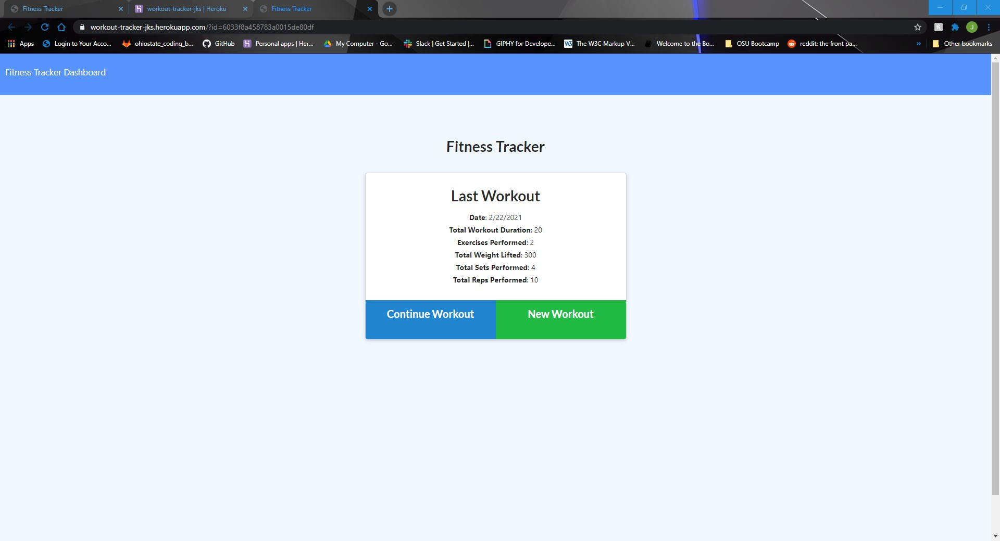

# Workout Tracker

  ## Description
  This project is a fitness app that lets users create and track daily workouts. [Heroku Link](https://workout-tracker-jks.herokuapp.com/)

  
  

  ## Table of Contents
  * [Installation](#installation)
  * [Credits](#credits)
  * [Contributions](#contributions)
  * [Questions](#questions)
  * [License](#license)
   
  ## Installation
  ### Requires
  * MongoDB
  * Node

  1.) Clone the repo from github 2.) Pull up the project in your file directory 3.) Type "npm i" into the console to install the required modules 4.) Enter "node server.js" to start the server 5.) Type "localhost:3000" into your browser and enter to use the app.
  ## Credits
  Jordan Stuckman
  ## Contributions
  Contact me by email or just submit a pull request.
  ## Questions
  If you have any questions or feedback, contact me at jordanks93@gmail.com.
  My github profile is jordanks93.
  ## License
  MIT